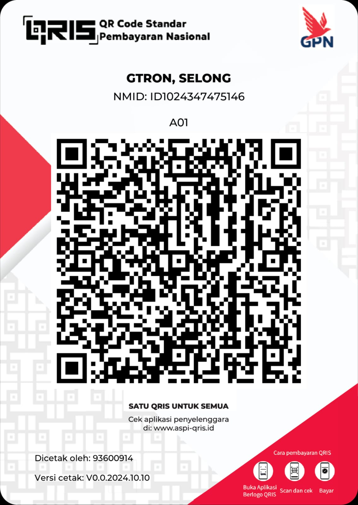
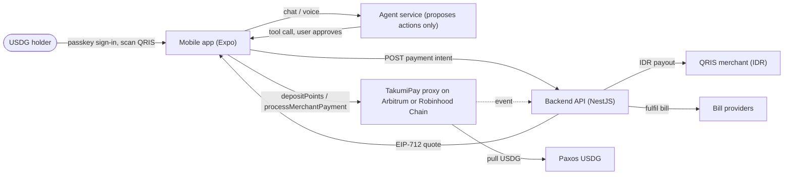

# TakumiPay: Arbitrum Open House Singapore (Online Buildathon) submission

**One sentence:** TakumiPay bridges USDG to QRIS, one of the largest QR payment networks in Southeast Asia, so USDG holders on Arbitrum and Robinhood Chain can scan a QRIS code and spend USDG at Indonesian merchants (QRIS is reported to reach 44M+ merchants) while the merchant receives rupiah.

**The gap:** stablecoin holders on Arbitrum and Robinhood Chain have nowhere to spend USDG in the real economy without a manual off-ramp to a bank. Indonesia already has a national QR rail that almost every shop and street vendor accepts. TakumiPay connects the two: the wallet reads the QRIS code, quotes the rupiah price in USDG, settles on-chain through the `TakumiPay` contract, and the merchant is paid in IDR. The same on-chain path also pays bills (electricity, phone credit, mobile data). Sign-up uses a passkey, so there is no seed phrase.

This is the hub repository. It indexes the four code repositories and lists every on-chain deployment with transaction hashes.

**Highlights**
- Live on Arbitrum One, Arbitrum Sepolia and Robinhood Chain testnet, with USDG enabled on all three.
- Real Paxos testnet USDG moved through `createTransaction`, `depositPoints` and `processMerchantPayment` (priced by a signed EIP-712 quote). Transaction hashes are in section 4.
- QRIS scan-to-pay in the app, with a test merchant you can scan straight from this page.
- Passkey sign-up, so there is no seed phrase to lose.
- A contract built to hold money: UUPS proxy, replay-safe signed quotes, token allowlist, per-token exit caps with timelocks, and 178 test functions.

**Contents:** [Deployed contracts](#deployed-contracts) · [Try it](#try-it-test-qris-merchant) · [Fact sheet](#1-fact-sheet) · [Evidence by judging criterion](#2-judging-criteria-mapped-to-evidence) · [Deployments](#3-deployments) · [Live testnet proof](#4-what-was-exercised-live) · [Reproduce](#5-reproduce-the-on-chain-claims) · [Architecture](#6-architecture) · [Roadmap](#8-roadmap-grant-milestones)

---

## Deployed contracts

`TakumiPay` v2.1.0 (UUPS proxy) is deployed on Arbitrum mainnet, Arbitrum testnet and Robinhood Chain testnet. The **proxy** is the address the app calls. Each row links to the deployment record with every configuration transaction hash.

| Network | Type | Chain ID | TakumiPay proxy | Implementation | Stablecoins enabled | Record |
|---|---|---|---|---|---|---|
| Arbitrum One | mainnet | 42161 | [`0xdE981573883294dfD35A7F0F399DB7e439E1f56B`](https://arbiscan.io/address/0xdE981573883294dfD35A7F0F399DB7e439E1f56B) | [`0x64E3E218BC06b6D6F2979805Bc581af748F2DF2D`](https://arbiscan.io/address/0x64E3E218BC06b6D6F2979805Bc581af748F2DF2D) | USDG, USDC | [`42161.json`](https://github.com/Planckify-Labs/arbitrum-submission-contract/blob/main/evm/deployments/42161.json) |
| Arbitrum Sepolia | testnet | 421614 | [`0x2469Bd87e809772f491af0E7847fbf7B62c388ae`](https://sepolia.arbiscan.io/address/0x2469Bd87e809772f491af0E7847fbf7B62c388ae) | [`0xf8A245B2192d3bc51218A783b04c8714c6b5c828`](https://sepolia.arbiscan.io/address/0xf8A245B2192d3bc51218A783b04c8714c6b5c828) | USDG, USDC | [`421614.json`](https://github.com/Planckify-Labs/arbitrum-submission-contract/blob/main/evm/deployments/421614.json) |
| Robinhood Chain testnet | testnet | 46630 | [`0x479B0843C3e0627f36551660506dEd5b349Fa968`](https://explorer.testnet.chain.robinhood.com/address/0x479B0843C3e0627f36551660506dEd5b349Fa968) | [`0x1aC593085Fa34c651E805085da4b2cabAC676F99`](https://explorer.testnet.chain.robinhood.com/address/0x1aC593085Fa34c651E805085da4b2cabAC676F99) | USDG | [`46630.json`](https://github.com/Planckify-Labs/arbitrum-submission-contract/blob/main/evm/deployments/46630.json) |

USDG addresses: Arbitrum One `0x004B506865409877C9fA29bfb1ebA929984B9bbC`, Arbitrum Sepolia `0xFFC95faa3d63Cde504a05B567C600B78C0b41892`, Robinhood testnet `0x7E955252E15c84f5768B83c41a71F9eba181802F`. Source: [`TakumiPay.sol`](https://github.com/Planckify-Labs/arbitrum-submission-contract/blob/main/evm/src/TakumiPay.sol). Full details, token tables and transaction hashes are in sections 3 and 4.

---

## Try it: test QRIS merchant

The backend has one QRIS merchant registered for testing: **GTron, SELONG** (NMID `ID1024347475146`, QRIS PAN `936009143669405532`, seeded in `src/scripts/prisma/seed.ts` of the api repo). This is the printed QRIS sticker for it:



How to use it:
1. Install the [preview APK](https://drive.google.com/file/d/1h1OTzwFwwR9FzChcKUNEp061nYt7gfJo/view?usp=sharing) on an Android phone and sign up with a passkey.
2. Choose Arbitrum Sepolia or Robinhood Chain testnet and hold testnet USDG.
3. Open **Scan to pay**. Scan this image from another screen, or save it to the phone and use **Pick from gallery**.
4. The app reads the QRIS code, asks the backend for a rupiah price quoted in USDG, and shows the quote for approval. Approve with the passkey to send `processMerchantPayment` on-chain.

Notes:
- This is a real shop's public QRIS sticker, so use it only inside TakumiPay on testnet, not in a bank or e-wallet app. The seeded payout details for it are placeholders.
- Paxos testnet USDG has no public faucet, so a live run needs a wallet that already holds testnet USDG. The demo video shows the full flow: https://youtu.be/ZwcOpxk1QX8
- Registered merchants resolve today (pilot cohort), growing toward any QRIS merchant.

---

## 1. Fact sheet

| Field | Value |
|---|---|
| Project name | TakumiPay (Android package `com.planckify.takumiwallet`) |
| Team | Planckify Labs |
| Hackathon | Arbitrum Open House Singapore: Online Buildathon (HackQuest) |
| Track | Overall Prize, and Promising Products Track |
| Chains deployed | Arbitrum One (42161), Arbitrum Sepolia (421614), Robinhood Chain testnet (46630) |
| Chains supported in this build | Arbitrum One, Arbitrum Sepolia, Robinhood Chain (4663), Robinhood Chain testnet |
| Stablecoin | Paxos USDG (Global Dollar) |
| Smart contract | `TakumiPay` v2.1.0, UUPS proxy, Solidity 0.8.30, EVM `cancun`, optimizer 200 runs, `viaIR` |
| Payment rail | QRIS (Indonesia's national QR standard); the merchant receives IDR |
| QRIS reach cited | 44M+ merchants, as publicly reported for the whole QRIS network. Reported size of the QRIS network |
| Mobile app | React Native + Expo (Android preview build) |
| Backend | NestJS + Prisma + PostgreSQL |
| Agent service | NestJS, Vercel AI SDK, Kimi K2.6 via Moonshot, Deepgram for speech to text |
| License | GPL-3.0 (see [`LICENSE`](./LICENSE)) |
| Demo video | https://youtu.be/ZwcOpxk1QX8 |
| Preview APK (Android) | [Download from Google Drive](https://drive.google.com/file/d/1h1OTzwFwwR9FzChcKUNEp061nYt7gfJo/view?usp=sharing) |
| Source of truth for deployments | `evm/deployments/{42161,421614,46630}.json` in the contract repo |

### Repositories

| Repository | What it holds | Stack |
|---|---|---|
| [`arbitrum-submission-contract`](https://github.com/Planckify-Labs/arbitrum-submission-contract) | `TakumiPay.sol`, deploy scripts, Foundry tests, deployment records | Solidity, Foundry |
| [`arbitrum-submission-mobile-app`](https://github.com/Planckify-Labs/arbitrum-submission-mobile-app) | Wallet app: passkey login, USDG send/receive, points deposit, bill and merchant payment, Takumi Agent chat | React Native, Expo, viem, NativeWind |
| [`arbitrum-submission-api`](https://github.com/Planckify-Labs/arbitrum-submission-api) | Chain and token catalog seeds, EIP-712 quote signing, payment intents, fulfilment queue, FX rates | NestJS, Prisma, PostgreSQL, Redis |
| [`arbitrum-submission-agent-api`](https://github.com/Planckify-Labs/arbitrum-submission-agent-api) | Natural-language agent that proposes wallet actions the app executes after user approval | NestJS, Vercel AI SDK |

---

## 2. Judging criteria mapped to evidence

### 2.1 Smart contract quality

Everything below is in `evm/src/TakumiPay.sol` (about 1,200 lines) of the contract repo.

| Property | Where to look | Notes |
|---|---|---|
| Upgradeable proxy | `initialize`, `_authorizeUpgrade`, `__gap` | UUPS, owner-gated, append-only storage |
| Signed pricing, replay-safe | `processMerchantPayment` | Requires an EIP-712 `QuoteCommitment` from the backend signer, with expiry and a one-shot `refId` (hash of the string, checked on-chain) |
| Token allowlist | `addAllowedPaymentToken`, `isAllowedPaymentToken` | Only allowlisted tokens are accepted. No implicit native bypass |
| Fee-on-transfer rejection | `_pullToken` | Asserts received balance delta equals the requested amount |
| Bounded treasury exits | `setSweepCap`, `queueSweepCap`, `applySweepCap`, `withdraw`, `queueWithdrawal`, `executeWithdrawal`, `recoverToken` | Per-token sweep cap that fails closed when unset |
| Time-delayed config | `setWithdrawalDelay`, `queueWithdrawalDelay`, `applyWithdrawalDelay` | Once a delay is set, raising a cap or lowering the delay is itself delayed |
| Two-step ownership | `transferOwnership`, `acceptOwnership`, `cancelOwnershipTransfer` | |
| Circuit breakers | `setPaused`, `setPointDepositsPaused` | Admin or owner |
| Signer rotation | `rotateBackendSigner` | Used during the Arbitrum deployments |
| Stored-value deposits | `depositPoints`, `getPointDepositByRef` | Points are a stored-value balance, not a reward scheme |
| Tests | `evm/test/*.t.sol` | 5 files, 178 test functions (`grep -c "function test"`). Run `cd evm && forge test` |

### 2.2 Product-market fit

- **Problem:** USDG on Arbitrum or Robinhood Chain is easy to hold and hard to spend. Turning it into everyday purchases means moving to an exchange, selling, and withdrawing to a bank, which costs time and fees and loses most small payments. Seed phrases and gas tokens keep ordinary users out.
- **Why QRIS:** Indonesia is a large market with high mobile and QR adoption, and QRIS is the national interoperable QR code that merchants of every size already display. QRIS is reported to cover 44M+ merchants. A wallet that can pay a QRIS code inherits that acceptance without asking merchants to adopt anything new.
- **Who:** crypto holders in or visiting Indonesia, and recipients of USDG remittances who need rupiah for daily spending.
- **Flow:** (1) create a wallet with a passkey; (2) hold USDG on Arbitrum or Robinhood Chain; (3) scan a QRIS code; (4) the backend prices the rupiah amount in USDG and signs an EIP-712 quote; (5) the user approves with the passkey and the app calls `processMerchantPayment`; (6) the contract pulls the USDG; (7) the backend pays the merchant in IDR through a licensed Indonesian payout provider. `depositPoints` converts USDG into a stored-value balance for users who want to pre-load, and the same path pays utility bills.
- **Retention hook:** daily spending. A user who can pay a street vendor, a coffee shop and an electricity bill from one balance has a reason to keep funds in USDG.
- **Live today:** QRIS scanning, USDG pricing, EIP-712 quote signing, on-chain settlement and IDR payout for registered merchants (pilot cohort). **Next:** open acceptance of any QRIS code with an acquiring and licensing partner.

### 2.3 Innovation and creativity

- Passkey-derived wallet (WebAuthn PRF extension), so there is no seed phrase to show or lose. Code: `services/walletKit/evm/mera/` in the mobile repo.
- A natural-language agent ("pay my electricity bill with 5 USDG") that can only propose actions. Every write goes through an approval card rendered from the tool arguments, not from model text. Code: `components/home/TakumiAgent/` (mobile) and `src/agents/` (agent-api).

### 2.4 Real problem solving

Stablecoins are widely held but rarely spendable. Linking USDG to a national QR network removes the off-ramp step for everyday purchases. The on-chain legs (`createTransaction`, `depositPoints`, `processMerchantPayment`) are exercised end to end on testnet with real Paxos testnet USDG (section 4).

### 2.5 USDG integration (extra consideration in the prize text)

- USDG is allowlisted on all three deployments (`addAllowedPaymentToken` transaction hashes in section 3).
- USDG is the stablecoin the mobile app uses. It is recognised by contract address, so a lookalike token named "USDG" at another address is not treated as USDG. See `USDG_ADDRESSES` in `services/tokens/tokenSupport.ts`.
- Live testnet calls with Paxos USDG: `createTransaction`, `depositPoints` on Arbitrum Sepolia and Robinhood testnet, plus `processMerchantPayment` on Robinhood testnet.
- Backend FX row `USDG -> IDR` exists so USDG payment intents price correctly (`src/scripts/prisma/seed.ts` in the api repo).

---

## 3. Deployments

The proxy is the address users and the app interact with.

| Network | Chain ID | Proxy | Implementation | Allowed tokens |
|---|---|---|---|---|
| Arbitrum One | 42161 | [`0xdE981573883294dfD35A7F0F399DB7e439E1f56B`](https://arbiscan.io/address/0xdE981573883294dfD35A7F0F399DB7e439E1f56B) | `0x64E3E218BC06b6D6F2979805Bc581af748F2DF2D` | USDG, USDC |
| Arbitrum Sepolia | 421614 | [`0x2469Bd87e809772f491af0E7847fbf7B62c388ae`](https://sepolia.arbiscan.io/address/0x2469Bd87e809772f491af0E7847fbf7B62c388ae) | `0xf8A245B2192d3bc51218A783b04c8714c6b5c828` | USDC, USDG |
| Robinhood Chain testnet | 46630 | [`0x479B0843C3e0627f36551660506dEd5b349Fa968`](https://explorer.testnet.chain.robinhood.com/address/0x479B0843C3e0627f36551660506dEd5b349Fa968) | `0x1aC593085Fa34c651E805085da4b2cabAC676F99` | USDG |

Token addresses:

| Token | Network | Address |
|---|---|---|
| USDG | Arbitrum One | `0x004B506865409877C9fA29bfb1ebA929984B9bbC` |
| USDC (Circle native) | Arbitrum One | `0xaf88d065e77c8cC2239327C5EDb3A432268e5831` |
| USDG | Arbitrum Sepolia | `0xFFC95faa3d63Cde504a05B567C600B78C0b41892` |
| USDC (Circle test) | Arbitrum Sepolia | `0x75faf114eafb1BDbe2F0316DF893fd58CE46AA4d` |
| USDG | Robinhood Chain testnet | `0x7E955252E15c84f5768B83c41a71F9eba181802F` |

Configuration transactions (each is a state change you can look up on the explorer):

| Network | Step | Transaction hash |
|---|---|---|
| Arbitrum One | `addAllowedPaymentToken(USDG)` | `0x68104e0b831433efa4046a4d6276d6c2a09b5531225977520fbf6ac88a80c54f` |
| Arbitrum One | `queueSweepCap(USDG, 1000e6)` | `0x4f21fdb23a9c876b32ed7c83c8c9f132035b3af14d148dc82b9466f9aac90ba3` |
| Arbitrum One | `applySweepCap(USDG)` | `0x855965f9061b84b4ec5af1e11ba0eb620d0fcf9c63cbc36198adfbf6fc7ad323` |
| Arbitrum One | `addAllowedPaymentToken(USDC)` | `0x446295545147d2662747df2b97f8b73980b840157de508e4ba19acac0f6890c8` |
| Arbitrum One | `setWithdrawalDelay(86400)` (24 hours) | `0x7b119dab01e2334cda7dfc688e8783a6b9c2119d4c6b2c258cda5ef8784b2912` |
| Arbitrum One | `rotateBackendSigner` | `0x86e7b276fd4694494132beeae2a34eaee63b752268c483217276debb4946ec67` |
| Arbitrum Sepolia | `addAllowedPaymentToken(USDG)` | `0x70f47a30dc590efd6ed91f18680bf09c1f053d706b5e0c6131ce47c5fd2fd6a5` |
| Robinhood testnet | `addAllowedPaymentToken(USDG)` | `0x3553e90e3a3179227348a7a62b472e9ed4aa8032460ecfdcd9cf452aa5ffc93d` |
| Robinhood testnet | `rotateBackendSigner` | `0xe06baeba53147ff52fa2d48988489bd73597029ee4ab712240d47dbb45d0d9b8` |

---

## 4. What was exercised live

Only testnets were exercised. Real Paxos testnet USDG was used (not a mock token).

| Network | Call | Amount | Transaction hash |
|---|---|---|---|
| Robinhood testnet | `createTransaction` | 1 USDG | `0xc6f89a2e65060a4aa81e74da88983e2d7f693836d4dd3b809f4b77858edc3cda` |
| Robinhood testnet | `depositPoints` | 1 USDG | `0x57f563bf3888cc450b440643383f14368ee4058409b3439aabf36ce1d1d6c71e` |
| Robinhood testnet | `processMerchantPayment` (real EIP-712 quote, fee 0.005 USDG) | 0.5 USDG | `0xab19a8f75dbabfe132e38d18b241de39f41ef067014fd440ca5e6fa232a82230` |
| Arbitrum Sepolia | `createTransaction` | 1 USDG | `0x3bb268dfa424ad7ce34823549c17e73871342331d53e26d16668d1f2be783b49` |
| Arbitrum Sepolia | `depositPoints` | 1 USDG | `0xf777754baeb29b4d5b84226cfdc70fcd609cbc2a10e8296cb9f4e8d286dc2011` |
| Arbitrum Sepolia | `createTransaction` | 1 USDC | `0x65830bfaae43d017795b6d3c569827cfd2bf407be3de576d6a6574121db39a50` |
| Arbitrum Sepolia | `depositPoints` | 1 USDC | `0xd3f21f7e8fecd4ae61a5f3b58e28a50b6bf47dfefdef23309c131a2ccbc30e54` |

Immediately after these runs the proxy's USDG balance on each testnet was `2000000` (2 USDG at 6 decimals; 1 from `createTransaction`, 1 from `depositPoints`), which confirmed both token pulls succeeded with no fee-on-transfer mismatch. Records read back through `getTransactionByRef` / `getPointDepositByRef` matched. Those balances change as the app uses the contracts, so a live read today will differ.

---

## 5. Reproduce the on-chain claims

Needs [Foundry](https://book.getfoundry.sh/) (`cast`).

```bash
# Version string of the Arbitrum One proxy (expected: "2.1.0")
cast call 0xdE981573883294dfD35A7F0F399DB7e439E1f56B "version()(string)" \
  --rpc-url https://arb1.arbitrum.io/rpc

# Allowed payment tokens on Arbitrum One (expected: USDG and USDC)
cast call 0xdE981573883294dfD35A7F0F399DB7e439E1f56B "getAllowedPaymentTokens()(address[])" \
  --rpc-url https://arb1.arbitrum.io/rpc

# Is USDG allowed on Arbitrum Sepolia? (expected: true)
cast call 0x2469Bd87e809772f491af0E7847fbf7B62c388ae \
  "isAllowedPaymentToken(address)(bool)" 0xFFC95faa3d63Cde504a05B567C600B78C0b41892 \
  --rpc-url https://sepolia-rollup.arbitrum.io/rpc

# Proxy USDG balance on Arbitrum Sepolia (was 2000000 right after the test runs; it changes with use)
cast call 0xFFC95faa3d63Cde504a05B567C600B78C0b41892 "balanceOf(address)(uint256)" \
  0x2469Bd87e809772f491af0E7847fbf7B62c388ae --rpc-url https://sepolia-rollup.arbitrum.io/rpc

# Run the contract test suite
git clone https://github.com/Planckify-Labs/arbitrum-submission-contract.git
cd arbitrum-submission-contract/evm && forge test
```

Run the other services:

```bash
git clone https://github.com/Planckify-Labs/arbitrum-submission-mobile-app.git
cd arbitrum-submission-mobile-app && pnpm install && pnpm start

git clone https://github.com/Planckify-Labs/arbitrum-submission-api.git
cd arbitrum-submission-api && pnpm install && pnpm start:dev

git clone https://github.com/Planckify-Labs/arbitrum-submission-agent-api.git
cd arbitrum-submission-agent-api && pnpm install && pnpm dev
```

The api and agent need their own `.env` (copy from `.env.example`). Several features need third-party keys that are not included.

---

## 6. Architecture



Text version of the payment path, for readers who skip diagrams:

1. The user scans a QRIS code. The app asks the backend for a payment intent. The backend prices it (FX row for the payer's token symbol) and signs an EIP-712 `QuoteCommitment` with the backend signer.
2. The user approves with the passkey. The app calls `processMerchantPayment` with the quote on the TakumiPay proxy.
3. The contract verifies the signature, expiry and unused `refId`, checks the token is allowlisted, pulls the exact amount of USDG, and records the transaction.
4. The backend sees the confirmed transaction and pays the merchant in IDR over the QRIS rail (or fulfils a bill: electricity token, phone credit, mobile data).

---

## 7. Originality and build disclosure

No hackathon window is asserted here. These are dated facts from git history so reviewers can judge for themselves.

| Date | Repo | Commit | What |
|---|---|---|---|
| 2026-09-08 | contract | `d75eb9e` | Deploy TakumiPay 2.1.0 to Arbitrum Sepolia, enable USDC |
| 2026-10-01 | contract | `b66b7bb` | Deploy to Arbitrum One, enable USDG and USDC |
| 2026-10-01 | contract | `dc9abf9` | Deploy to Robinhood Chain testnet, enable USDG |
| 2026-10-01 | api | `c0362ca`, `6e8af0d` | Register the Arbitrum and Robinhood chains and USDG token rows |
| 2026-10-02 | api | `5ea9483` | Add USDG to IDR FX rate |
| 2026-10-01 | mobile-app | `b296532`, `d01bfb9` | Passkey becomes the primary sign-in with multi-chain accounts; lock and notification prompt move to after the user lands on Home |
| 2026-10-01 | mobile-app | `4f49392` | Focus the app on Arbitrum and Robinhood Chain |
| 2026-10-02 | mobile-app | `03ee4cc`, `51d29e6` | Arbitrum/Robinhood copy; USDG token handling |

**Pre-existing work (before these dates):** the `TakumiPay` contract itself (v2.1.0 was already deployed to Arc and Base Sepolia before the Arbitrum deployments), the wallet, the passkey wallet layer (first built on Sep 18 for an earlier hackathon), the payment-intent and fulfilment backend, and the agent service. The Arbitrum work is deployment, chain and token configuration, making passkey the primary sign-in, USDG handling, and live verification on Arbitrum and Robinhood Chain.

**AI tool disclosure:** the code was written with AI assistance (Claude). The commit trailers `Co-Authored-By` mark commits made in AI-assisted sessions.


---

## 8. Roadmap (grant milestones)

1. Verify all contracts on Arbiscan and publish an independent review.
2. Move ownership to a multisig and the quote signer to a managed key (HSM or KMS).
3. Pilot QRIS payments on Arbitrum One with capped volume and a licensed acquiring partner, then widen from the registered-merchant cohort toward any QRIS merchant.
4. Deploy to Robinhood Chain mainnet and open the recipient flow to more corridors.

---

## 9. Questions a reviewer may ask

**Is this deployed on an Arbitrum chain?** Yes: Arbitrum One, Arbitrum Sepolia and Robinhood Chain testnet. Proxy addresses and explorer links are in section 3.

**Does it use USDG?** Yes, on all three deployments, and the app uses USDG as its stablecoin. Live testnet calls with Paxos testnet USDG are in section 4.

**Can I try the app?** Install the [Android preview APK](https://drive.google.com/file/d/1h1OTzwFwwR9FzChcKUNEp061nYt7gfJo/view?usp=sharing) on a physical device with biometrics. Passkey key derivation needs the WebAuthn PRF extension and a real platform authenticator; emulators usually cannot complete sign-up.

**How many merchants can a user pay?** QRIS is reported to reach 44M+ merchants across Indonesia. Registered merchants are payable today; opening acceptance to any QRIS code is the roadmap goal.

**Where is the real work?** `evm/src/TakumiPay.sol` (contract), `services/walletKit/evm/mera/` and `components/home/TakumiAgent/` (mobile), `services/paymentIntent/detectors/qris.ts` and `app/scan-to-pay.tsx` (QRIS scan), `src/pay/` and `src/points/` (api), `src/agents/` (agent-api).

---

<sub>Planckify Labs. GPL-3.0.</sub>
